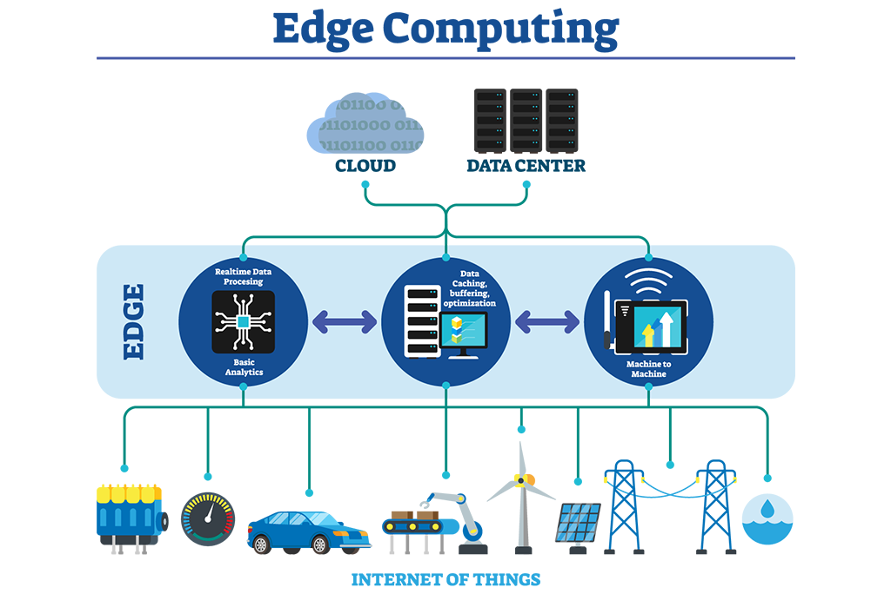
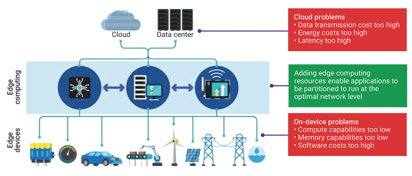
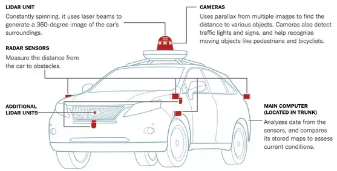

 Edge computing derives its name from the concept of storing and processing data in devices closer to the applications they serve compared to the more generic and popular cloud infrastructure. This concept has been formulaized over the past several years, starting with IoT and Big Data applications trying to provide a way to process the massive amounts of data around us to provide unique product features to the end consumer. It is enabled in the form of storage of zetabyte sized data in large data centers which is analyzed with massive hardware compute resources. The processed results are sent straight to end user devices like watches, smart media consumption devices, automatic dispensing machines among others. 

Over recent years, advancements in Artificial Intelligence have revolutionized different industry sectors with massive performance gains in the fields of computer vision, natural language processing, speech recognition and translation among others. The combined benefits of AI, IoT, large data processing and edge computing present unlimited application potential to virtually all sensors and human wearables that surround ourselves in these modern times. Specifically, Edge Computing has been envisioned as the driving force for harnessing the full potential of the other three technologies.
  

<h2 data-selectable-paragraph="">What exactly is Edge Computing ?</h2>

Edge Computing is generically defined as the concept of running any processing application on a local accessible machine which is closer to the end user device compared to a cloud based server. The cloud here is defined as an entity which has infinite memory and compute resources. In contrast, the edge represents an entity which has limited memory and compute resources housed in a form factor that is usually tens of magnitude smaller than cloud based servers. In general as you move from cloud based computing to edge computing the storage, memory and computing resources become less and less. The benefits of moving closer to the end user are not only in terms of lower power consumption but also lower processing latency and increased system efficiency. The system reliability and security also increases since the data is processed locally and not sent to a remote entity over a potentially vulnerable internet connection.  

Edge Computing can take up many different forms like low power embedded devices, local on-premise compute servers and even micro data centers. These end point devices are termed as “edge devices” which are theoretically a part of the overall edge computing ecosystem. Embedded AI chips currently represent the most popular avenue for edge computing applications due to their low power and small form factor features. The perfect example of this would be a smart watch which locally processes the different types of data available to it through its various sensors and provides on-time health statistics to the end user.
 

<h2 data-selectable-paragraph="">Why we need Edge Computing</h2>

The domain of cloud computing depends on the capabilities of modern Internet technology through which a large number of autonomous data capturing devices like CCTV cameras, personal mobile phones are continuously transmitting data to a centralized data center for storage and processing. It is estimated that more than 75 billion devices are already connected to the Internet as of 2020 and that this number is going to increase ten folds in the coming five years. 

Such a huge number of connected devices presents its own unique challenges to maintain the network efficiency and security of all these devices on the internet. Firstly, capacity limitations surface as a result of the massive amount of data collectively transmitted by these devices. Secondly, transmitting this large amount of data from the origin of creation to a data center is costly in terms of compute, bandwidth and energy power. Thirdly, reliability and security of the data being transmitted is also challenged as managing the sheer large number of data connections becomes difficult. This is very critical for sensitive proprietary data transfer.  

Edge computing provides a solution for the majority of concerns associated with cloud computing, which is as follows:

<b>1] Network Bandwidth:</b> Since data is processed locally, there is no dependency on the Internet and therefore large data transfers are avoided. This in itself provides large bandwidth and energy resource savings. 

<b>2] Data Security:</b> Sensitive data collected is more secure since it is processed locally with little to no access to outside hackers.

<b>3] System reliability:</b> It also improves system reliability since the application can continue to function even in case of power outages, network issues among others.

<b>4] System efficiency and low latency:</b> Edge computing aims at increasing system efficiency through reduction in communication latency that is generally induced by data transfer to and from a data center. This proves to be extremely critical for AI based applications like surveillance camera based person tracking, event detection and alert systems etc. which demand low latency and real time processing of AI models. Low processing latency enables devices to provide many innovative applications in autonomous vehicles, gaming platforms, or challenging, fast-paced manufacturing environments

Edge computing serves as the ideal middle ground between high compute power but high latency cloud domain and low compute power but low latency edge device domain. Edge devices in their current state lack the compute and memory bandwidth resources that a cloud based data center possesses. So even though there is negligible network latency induced while running an application directly at the edge device level, the bottleneck presents itself in the form of limited processing capacity that the edge device offers.
 

<h2 data-selectable-paragraph="">Self-Driving Cars:The ideal edge computing use case</h2>

The application of self-driving cars demands low latency, system privacy and reliability which can only be met through local edge sensor based computing. One simply cannot transfer the data from all different sensors that a self-driving car has to the cloud and expect the cloud to process it in real-time and send back the results. The application itself of a car being driven around in various areas, possibly remote locations makes the use of cloud computing moderately reliable at best due to highly probable network blackouts and transmission delays. 

Majority of self-driving car companies have thus moved all of their computing onto the ‘edge’ that is in this case the car itself. Data from different kinds of sensors like RGB-D cameras, lidar, proximity sensor etc. is processed locally through a central computing system present inside the car. Trained AI models leverage this processed data to locally provide real time, low latency car control decisions in order to tackle the constantly changing driving scenarios that the car experiences in a given drive.

<h2 data-selectable-paragraph="">In Conclusion</h2>

Edge computing is an important step towards bringing AI to the forefront of all major future applications. It brings cloud services closer to the edge devices. It offers lower latency and provides new applications and services to consumers. It presents itself as a technology that enables future hybrid computing where computing decisions can be made real time locally, in the cloud or at the device based on latency needs, power needs and overall storage and performance needs.

