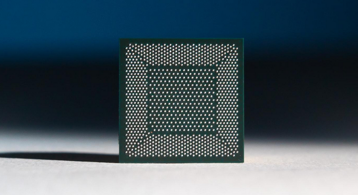

 The human brain, a remarkable product of evolution, has an energy footprint of about 20 watts. This enables the brain to process visual, auditory, language and other complex tasks in a matter of milliseconds. Our current hardware outperforms the human brain for serial processing tasks. However, the data transfer from memory to a processor and back creates latency and requires enormous amounts of energy. 

The first generation of Artificial Intelligence was deemed to be rules based and which imitated  classical logic to draw rational conclusions to a narrowly defined set of problems. The second generation in Artificial Intelligence is primarily based on learning complex high level representation of visual, auditory and other types of data in form of training neural inspired architectures in an end-to-end fashion. It leverages the modern day improvements made in hardware compute resources to train these architectures with massive amounts of labelled data. This has led to substantial performance improvements in major fields such as computer vision, natural language processing among others. However, these trained models lack the fundamental principle of causality which is how we humans perceive and understand things around us. We break down each observed  phenomena into smaller sub-parts and try to understand how these parts might have led to the observed phenomena. A good example of this would be the observed phenomena of a couple of people rowing a boat in a river. Our human cognition system on perceiving such an event tries to break it down into sub-parts like the generic boat shape, the motion of oars pushing the water back which causes the boat to move forward among others. This in turn helps us to still understand this phenomena later on when maybe the boat type and shape has changed or the oars look different. The current generation of Artificial Intelligence lacks the development of any such causal inference. Thus it easily breaks down with even slight manipulation of data it has been trained on.

The next generation of Artificial Intelligence termed ‘neuromorphic intelligence’, thus focuses on trying to match a human's flexibility, and ability to learn from unstructured stimuli with the energy efficiency of the human brain.
 

<h2 data-selectable-paragraph="">What is Neuromorphic Computing ?</h2>
<figure>

<figcaption>Building blocks of a neuromorphic chip Credit: BrainChip</figcaption>
</figure>

Neuromorphic systems attempt to imitate how the human nervous system operates. It tries to imitate the structure of biological sensing and information processing nervous systems. In other words, neuromorphic computing implements aspects of biological neural networks as analogue or digital copies on electronic circuits.

“Neuromorphic" literally means "taking the form of the brain."  The engineering of a neuromorphic device involves the development of components whose functions are analogous to parts of the brain, or at least to what such parts are believed to do. These components are not brain-shaped, of course, yet like the valves of an artificial heart, they do fulfill the roles of their organic counterparts. Some architectures go so far as to model the brain's perceived plasticity (its ability to modify its own form to suit its function) by provisioning new components based on the needs of the tasks they're currently running.

The computational building blocks within neuromorphic computing systems are logically analogous to neurons. Spiking neural networks (SNNs) are a novel model for arranging those elements to emulate natural neural networks that exist in biological brains. Each “neuron” in the SNN can fire independently of the others, and doing so, it sends pulsed signals to other neurons in the network that directly change the electrical states of those neurons. By encoding information within the signals themselves and their timing, SNNs simulate natural learning processes by dynamically remapping the synapses between artificial neurons in response to stimuli.

<h2 data-selectable-paragraph="">The need for neuromorphic computing</h2>

Professor Dmitir Strukov, an electrical engineer at University of California at Santa Barbara mentions in an interview with Nature Communications that “Artificial Intelligence (AI) needs new hardware, not just new algorithms. We’re at a turning point, where Moore’s law is reaching its end leading to a stagnation of the performance of our computers. Nowadays, we are generating more and more data that needs to be stored and classified. Recent advances in AI allow automating this process, with data centers multiplying at a cost of consuming an exponentially increasing amount of electricity, which is a potential problem for our environment. This energy consumption mainly comes from data traffic between memory and processing units that are separated in computers. It wastes electrical energy and it considerably slows down computational speed.”

He further adds that the idea of neuromorphic computing is to take inspiration of the brain for designing computer chips that merge memory and processing. In the brain, synapses provide a direct memory access to the neurons that process information. That is how the brain achieves impressive computational power and speed with very little power consumption. By imitating this architecture, neuromorphic computing provides a path to building smart neuromorphic chips that consume very little energy and, meanwhile, compute fast. 

<h2 data-selectable-paragraph="">Current efforts in Neuromorphic Computing</h2>

Many significant academic and industry efforts have been put in developing neuromorphic chips or at least developing a feasible prototype. Some of them are as follows:

<b>1] Intel</b>
<figure>

<figcaption>Intel Loihi Chip</figcaption>
</figure>

<b><a href="https://www.intel.com/content/www/us/en/research/neuromorphic-computing.html">Intel</b></a> has put its research efforts into developing neuromorphic chip architecture coined as “Loihi”. It is touted to have a form of the same 14 nm lithography techniques Intel and others employ today. First announced in September 2017, and officially premiered the following January at CES 2018 by then-CEO Brian Krzanich, Loihi's microcode includes statements designed specifically for training a neural net. It's designed to implement a SNN, whose model adds more brain-like characteristics.

<figure>

<figcaption>A close-up shot of an Intel Nahuku board, each of which contains 8 to 32 Intel Loihi neuromorphic chips. Intel’s latest neuromorphic system, Pohoiki Beach, is made up of multiple Nahuku boards and contains 64 Loihi chips. Pohoiki Beach was introduced in July 2019. (Credit: Tim Herman/Intel Corporation)</figcaption>
</figure>

In March 2020, Intel released Pohoiki Springs, its latest and most powerful neuromorphic research system providing the computational capacity of 100 million neurons. Pohoiki Springs is a data center rack-mounted system and is Intel’s largest neuromorphic computing system developed to date. It integrates 768 Loihi neuromorphic research chips inside a chassis the size of five standard servers.

<b>2] IBM</b>

IBM maintains a Neuromorphic Devices and Architectures Project involved with new experiments in analog computation. In a research paper, the IBM team demonstrated how its non-volatile <b><a href="https://www.ibm.com/blogs/research/2018/07/phase-change-memory">phase-change memory</a></b> (PCM) accelerated the feedback or backpropagation algorithm associated with neural nets. These researchers are now at work determining whether PCM can be utilized in modeling synthetic synapses, replacing the static RAM-based arrays used in its earlier non-neuromorphic TrueNorth and NeuroGrid designs.

<b>3] SpiNNaker</b>

<b><a href="http://apt.cs.manchester.ac.uk/projects/SpiNNaker">SpiNNaker</a></b>  is a low-grade supercomputer developed by engineers with Germany's Jülich Research Centre's Institute of Neuroscience and Medicine, working with the UK's Advanced Processor Technologies Group at the University of Manchester. Its job is to simulate the functions so-called cortical microcircuits, albeit on a slower time scale than they would presumably function when manufactured. In August 2018, Spinnaker conducted what is believed to be the largest neural network simulation to date, involving about 80,000 neurons connected by some 300 million synapses.

<b>4] Brainchip</b>

<figure>

<figcaption>Akida Neural Processor (credit: Brainchip)
</figure>

Founded in 2006, <b><a href="https://brainchipinc.com/">BrainChip</a></b> is the brainchild of a guy named Peter van der Made, who invented one of the earliest high-resolution color graphics accelerator chips for the IBM personal computer back. BrainChip  introduced a neuromorphic chip called Akida last year that implements SNN for edge computing applications in image recognition, as well as financial analysis and cybersecurity. Each Akida chip has the equivalent of 1.2 million neurons and 10 billion synapses, representing 100 times better efficiency than neuromorphic test chips from Intel and IBM, according to BrainChip. In 2016, the company acquired a French AI computer vision company called SpikeNet Technologies for about $1.5 million. BrainChip leveraged SpikeNet’s SNN software suite to create <b><a href="https://www.brainchipinc.com/products/brainchip-studio">BrainChip Studio</b></a>, which helps law enforcement to rapidly search vast amounts of video footage and identify patterns or faces. The SNN technology makes the software particularly effective at scrolling through low-resolution video to detect and classify faces.

<h2 data-selectable-paragraph="">The future of neuromorphic computing </h2>

Recently, Intel and Sandia National Laboratories signed a <b><a href="https://newsroom.intel.com/news/intel-sandia-national-labs-neuromorphic-computing/#gs.hy0ruu">three-year agreement</b></a> to explore the value of neuromorphic computing for scaled-up Artificial Intelligence problems. According to Intel, Sandia will kick-off its research using a 50-million neuron Loihi-based system that was delivered to its facility in Albuquerque, New Mexico. This initial work with Loihi will lay the foundation for the later phase of the collaboration, which is expected to include continued large-scale neuromorphic research on Intel’s upcoming next-generation neuromorphic architecture and the delivery of Intel’s largest neuromorphic research system to this date, which could exceed more than 1 billion neurons in computational capacity.

One of the goals of the joint effort aims to better understand how emerging technologies, such as neuromorphic computing, can be utilized as a tool to address some of the current most pressing scientific and engineering challenges. These challenges include problems in scientific computing, counterproliferation, counterterrorism, energy, and national security. The future possibilities with neuromorphic computing are encouraging.

